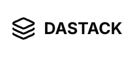

# Dastack

<div align="center">
  
  <h3>Ready-to-fly Next.js Starter Kit</h3>
  <p>Accelerate your web application development with a modern, feature-rich tech stack.</p>
  
  <p>
    <a href="https://nextjs.org"></a>
    <a href="https://react.dev"></a>
    <a href="https://www.typescriptlang.org"></a>
    <a href="https://tailwindcss.com"></a>
    <a href="https://ui.shadcn.com"></a>
    <a href="https://prisma.io"></a>
  </p>
</div>

## ✨ Features

Dastack comes packed with modern web development essentials:

- 🚀 **Next.js 15** with App Router for advanced routing capabilities
- ⚛️ **React 19** with latest APIs and performance improvements
- 📘 **TypeScript** for robust type-checking and developer experience
- 🎨 **TailwindCSS v4** for utility-first styling
- 🛠️ **Shadcn/ui** for beautiful, accessible UI components
- 🛡️ **Prisma ORM** for type-safe database access
- 📋 **React Hook Form** with Zod validation for form handling
- 🔍 **Tanstack Query** for optimized data fetching and caching
- 🔹 **Lucide Icons** for consistent, high-quality icons
- 🌑 **Dark mode** support with next-themes
- ⚙️ **T3-env** for type-safe environment variables
- 🌐 **i18n with next-intl** for internationalization
- 💯 **Perfect Lighthouse score** for optimal performance

## 🌟 Premium Components

Dastack includes ready-to-use business components to jumpstart your project:

- **Admin CRUD Pages** - Complete admin interface with create, read, update, delete functionality
- **Keyboard Navigation** - Full keyboard support with custom shortcuts
- **Audio Stream Widget** - Voice-first functionality with audio streaming
- **File Management** - Comprehensive file upload and management system
- **Calendar Component** - Interactive calendar for scheduling and events

## 🚀 Getting Started

### Prerequisites

- Node.js 18.17 or later
- pnpm package manager

### Installation

1. Clone the repository:
```bash
git clone https://github.com/yourusername/dastack.git
cd dastack
```

2. Install dependencies:
```bash
pnpm install
```

3. Set up environment variables:
Create a `.env` file in the root directory with the following variables:
```
DATABASE_URL='your-database-url'
APP_URL='http://localhost:3000'
GOOGLE_SITE_VERIFICATION_ID='your-google-verification-id'
REACT_SCAN=
OPENAI_API_KEY='your-openai-api-key' # Optional, only if using AI features
ANTHROPIC_API_KEY='your-anthropic-api-key' # Optional, only if using AI features
```

4. Set up the database:
```bash
pnpm dlx prisma generate
pnpm dlx prisma migrate dev
pnpm db:seed # Optional, seeds the database with initial data
```

### Development

Start the development server:
```bash
pnpm dev
```

This will start the application at [http://localhost:3000](http://localhost:3000).

### Production

Build for production:
```bash
pnpm build
```

Start the production server:
```bash
pnpm start
```

## 📚 Documentation

Visit our [documentation](https://your-domain.com/docs) for detailed guides, API references, and examples.

## 🧪 Query Optimization

Dastack implements TanStack React Query for optimized data fetching and caching, providing:

- Automatic caching to minimize API calls
- Background refetching for fresh data
- Optimistic updates for responsive UI
- Stale-while-revalidate pattern
- Request deduplication to prevent duplicate calls

## 📝 License

This project is licensed under the MIT License - see the [LICENSE](LICENSE) file for details.

## 🙏 Acknowledgements

- [Next.js](https://nextjs.org)
- [React](https://react.dev)
- [TailwindCSS](https://tailwindcss.com)
- [Shadcn/ui](https://ui.shadcn.com)
- [Prisma](https://prisma.io)
- [React Hook Form](https://react-hook-form.com)
- [Zod](https://zod.dev)
- [Lucide Icons](https://lucide.dev)
- [Next Themes](https://github.com/pacocoursey/next-themes)
- [Next-intl](https://next-intl-docs.vercel.app)

---

<div align="center">
  <p>Built with ❤️ by the Dastack Team</p>
</div>
